<p align="center">
  
</p>

<h1 align="center">Public Announcement Management System (PAMS)</h1>

<p align="center">
  A Raspberry Pi + Arduino–based campus communication platform for managing announcements across digital displays and public-address audio systems.
</p>

<p align="center">
  
  
  
  
  
  
</p>

---

PAMS is an academic thesis project that combines a **Flask web application, SQLite database, Raspberry Pi, Arduino-controlled speaker zones, digital display rendering, audio/TTS processing, and announcement scheduling** into one centralized campus communication platform — giving administrators a single dashboard to create, schedule, broadcast, and monitor campus-wide announcements.

> **Portfolio note:** This repository is a cleaned, sanitized public version of the thesis project. Private credentials, deployment data, personal records, runtime databases, generated media, and machine-specific configuration have been excluded. See [Security & Privacy](#-security--privacy) below.

---

## 📑 Table of Contents

- [Features](#-features)
- [Screenshots](#-screenshots)
- [System Architecture](#%EF%B8%8F-system-architecture)
- [Technology Stack](#%EF%B8%8F-technology-stack)
- [Repository Structure](#-repository-structure)
- [Local Setup](#-local-setup)
- [Hardware Integration](#-hardware-integration)
- [Security & Privacy](#-security--privacy)
- [External Notification Services](#-external-notification-services)
- [Database & Runtime Data](#-database--runtime-data)
- [Media](#%EF%B8%8F-media)
- [Academic Context](#-academic-context)
- [My Role](#-my-role)
- [Future Improvements](#-future-improvements)
- [License](#-license)
- [Author](#-author)

---

## ✨ Features

- 📢 **Announcement Management** — Create and manage campus announcements through a web interface, with live text-display and audio broadcast controls.
- ⏰ **Scheduled Announcements** — Schedule announcements for specific dates and times via an APScheduler-backed queue.
- 🚨 **Emergency Broadcasting** — Trigger urgent, high-priority announcements that interrupt normal display/audio playback.
- 🖥️ **Digital Display System** — Render text, images, and video on a connected display, with a configurable idle mode (welcome screen, slideshow, or video loop).
- 🔊 **Audio & Text-to-Speech** — Generate and play announcement audio using TTS (gTTS/pyttsx3) or recorded audio clips.
- 🔀 **Speaker Zoning** — Control multiple speaker zones live through an Arduino-connected relay system, with real-time status badges and LED indicators.
- 👥 **Student/Contact Management** — Manage recipient/contact records used across the application workflow.
- 📊 **System Monitoring** — Live dashboard for CPU temperature, CPU/memory/disk usage, uptime, and a rolling 24-hour activity log.
- 🔐 **Authentication & Security** — Role-based access control with hashed passwords.
- 💾 **Local Database** — SQLite-based storage for all application data.
- 🧩 **Hardware Integration** — Raspberry Pi ↔ Arduino communication over a serial/USB interface.

> **SMS and email notification services are disabled in this public repository.** Their implementation points are represented by safe local modules without provider credentials or external service access.

---

## 🖼️ Screenshots

A quick look at the admin web interface.

### Dashboard — live system & speaker status
Real-time CPU/memory/disk metrics, a live clock, per-zone speaker status with LED indicators, the idle-display media manager, and a rolling activity log.

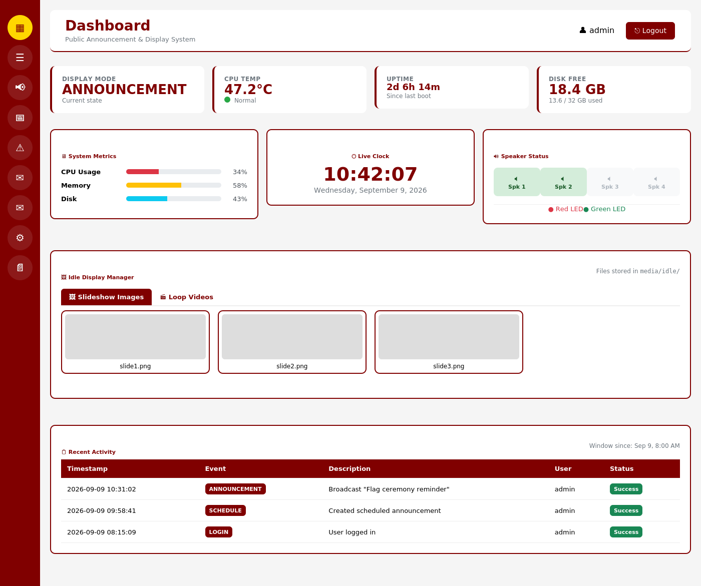

### Announcements — display & audio control
Switch idle-display modes (welcome screen, slideshow, video loop), push live text to the display, and generate or play TTS/audio announcements.

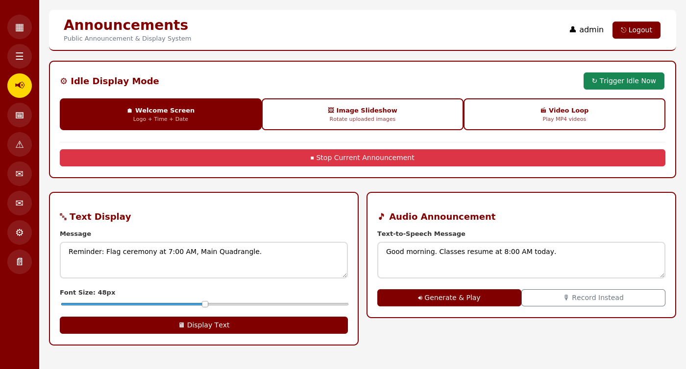

### Login
Role-based sign-in screen for administrators.

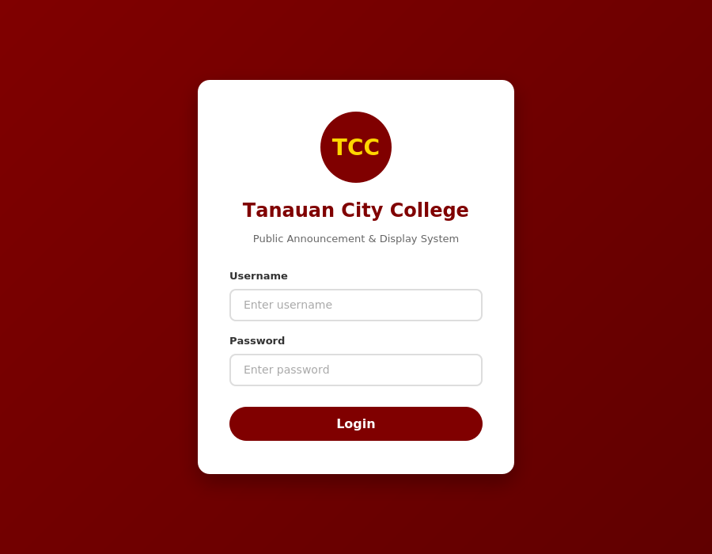

### Schedule — recurring & one-off announcements
View active schedules and queue new text, audio, video, or TTS announcements for a future date and time.

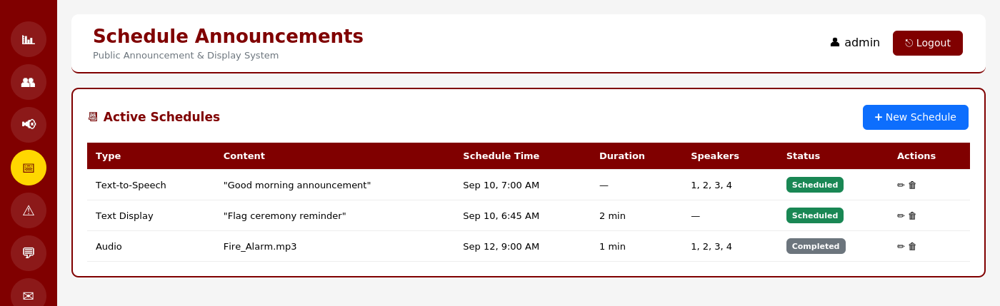

### Emergency — one-tap crisis broadcast
Trigger fire, earthquake, lockdown, evacuation, or medical alerts that override every display and speaker zone at once, plus manage emergency audio files and procedures.

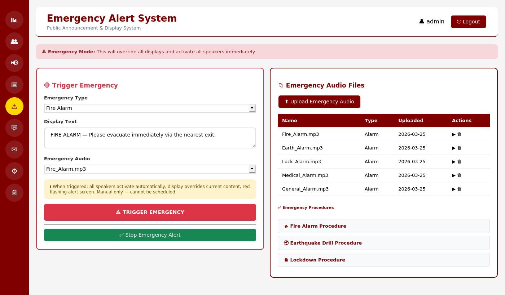

### Students — recipient database
Add, edit, bulk-import (CSV), or remove student/contact records used across the announcement workflow.

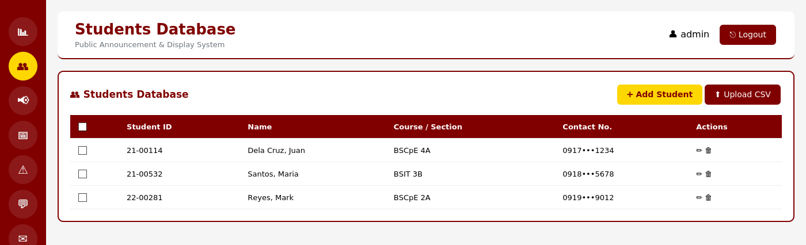

### SMS & Email — additional notification channels
Compose and send SMS or email announcements to selected recipients, with a running history of what was sent. *(Provider access is disabled in this public build — see [External Notification Services](#-external-notification-services).)*

<p>
  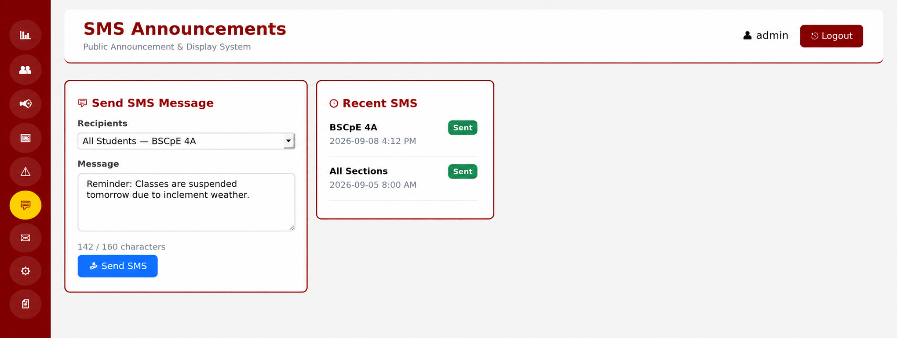
  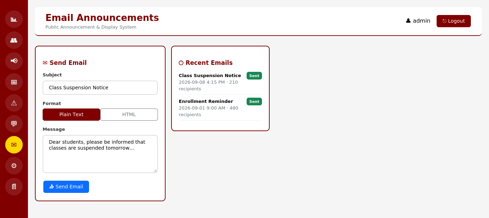
</p>

### Logs — full activity history
Filter the complete system activity log by type, status, or date range, and export results to CSV.

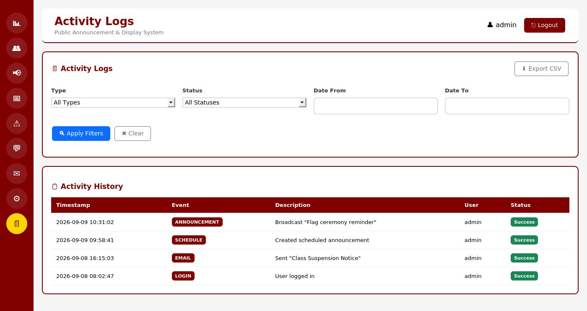

### Settings — device configuration & diagnostics
Configure the Arduino serial port, audio output, display resolution, and default volume; test individual relays/speakers; and manage admin/staff user accounts.

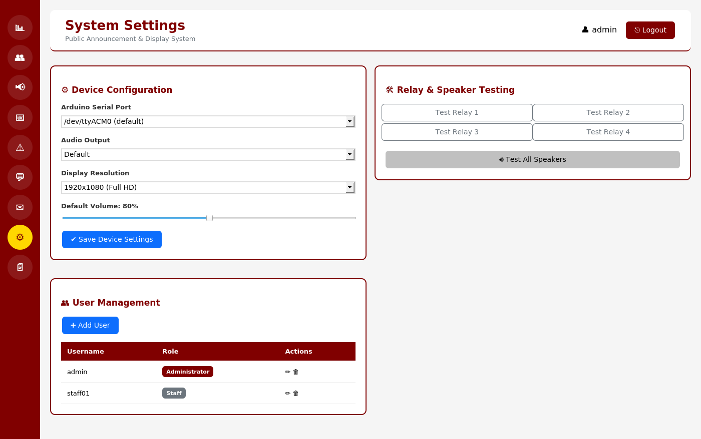

---

## 🏗️ System Architecture

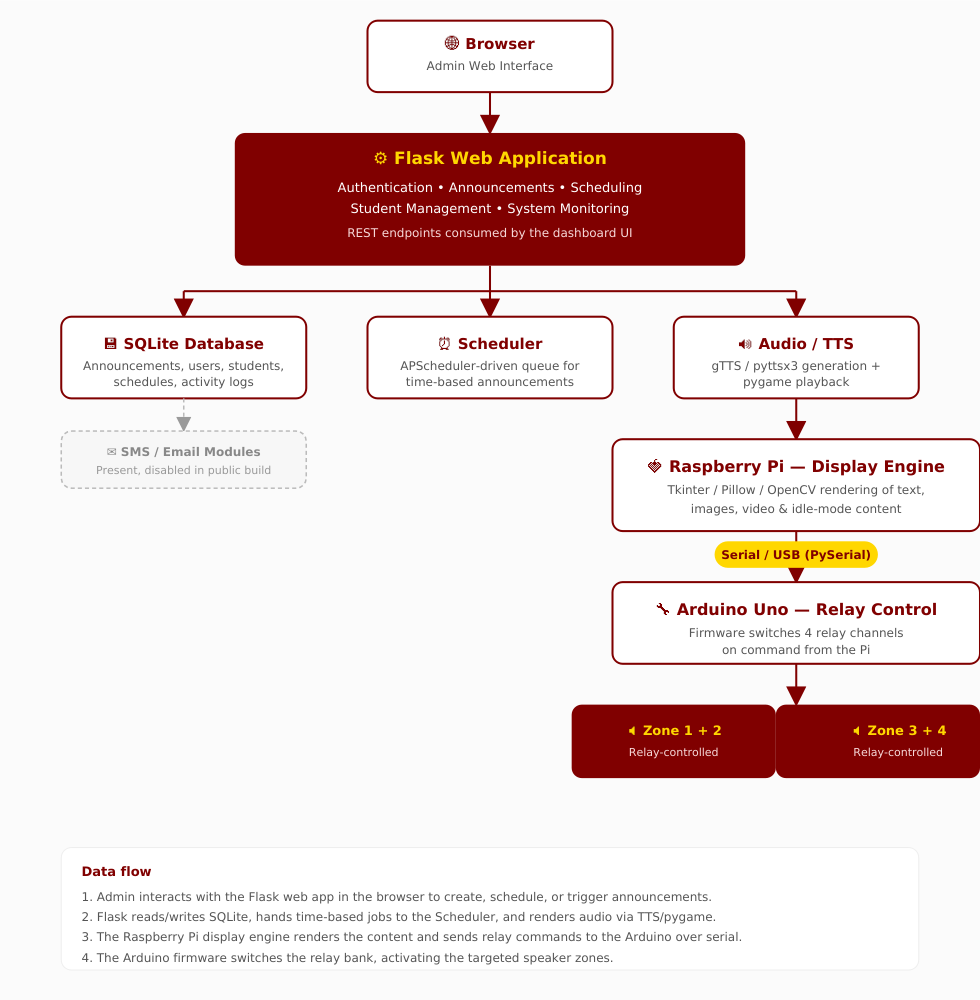

**Data flow**

1. The administrator interacts with the Flask web app in the browser to create, schedule, or trigger announcements.
2. Flask reads/writes SQLite, hands time-based jobs to the Scheduler, and generates announcement audio through the TTS/pygame pipeline.
3. The Raspberry Pi display engine renders the resulting text, image, or video content and sends relay commands to the Arduino over a serial/USB connection.
4. The Arduino firmware switches the relay bank, activating the targeted speaker zones — completing the loop from a single web action to a campus-wide broadcast.

The SMS and email modules sit alongside the same Flask app but are disabled in this public build (see [External Notification Services](#-external-notification-services)).

---

## 🛠️ Technology Stack

<div align="center">

| Category | Technologies |
|:---:|:---:|
| **Backend** | Python, Flask |
| **Frontend** | HTML, CSS, JavaScript, Bootstrap 5 |
| **Database** | SQLite |
| **Display** | Tkinter, Pillow, OpenCV |
| **Audio / TTS** | pygame, gTTS, pyttsx3 |
| **Scheduling** | APScheduler |
| **Hardware** | Raspberry Pi, Arduino Uno, Relay Module |
| **Communication** | PySerial |
| **Security** | Werkzeug Password Hashing, Cryptography |

</div>

---

## 📂 Repository Structure

```text
public-announcement-management-system/
│
├── app.py                    # Flask application
├── config.py                 # Application configuration
├── database.py                # Database schema and initialization
├── display.py                 # Digital display engine
├── audio_handler.py           # Audio and TTS processing
├── arduino_comm.py            # Arduino serial communication
├── scheduler.py               # Scheduled announcement handling
├── sms_handler.py              # Public-safe SMS interface
├── email_handler.py            # Public-safe email interface
├── security_utils.py           # Security utilities
├── system_monitor.py           # System monitoring
├── create_folders.py           # Runtime directory setup
│
├── arduino/
│   └── relay_control.ino       # Arduino relay-control firmware
│
├── templates/                  # Flask HTML templates
│
├── docs/
│   └── screenshots/             # README screenshots
│
├── media/
│   └── images/                  # Project logo and public assets
│
├── sample_students.csv          # Synthetic demonstration data
│
├── .env.example                 # Local configuration template
├── .gitignore                   # GitHub exclusions
├── requirements.txt              # Python dependencies
│
├── install.sh                   # Installation helper
├── start_tcc.sh                  # Application startup script
└── stop_tcc.sh                   # Application shutdown script
```

---

## 🚀 Local Setup

### 1. Clone the repository

```bash
git clone https://github.com/krei-labs/public-announcement-management-system.git
cd public-announcement-management-system
```

### 2. Create a virtual environment

```bash
python3 -m venv .venv
source .venv/bin/activate
```

For Windows:

```powershell
python -m venv .venv
.venv\Scripts\activate
```

### 3. Install dependencies

```bash
pip install -r requirements.txt
```

### 4. Configure local environment variables

Copy the example configuration:

```bash
cp .env.example .env
```

Then edit `.env` with your own **local** configuration:

```text
SECRET_KEY=
ADMIN_USERNAME=
ADMIN_PASSWORD=

DATABASE_PATH=announcement_system.db

ARDUINO_PORT=/dev/ttyACM0
ARDUINO_BAUD=9600
```

> ⚠️ **Choose your own `ADMIN_USERNAME` / `ADMIN_PASSWORD`.** Never commit `.env` to GitHub — it's already excluded via `.gitignore`.

### 5. Initialize the database

```bash
python3 database.py
```

This creates a fresh SQLite database from the application's schema. The public repository does **not** include the original thesis database or any deployment records.

`sample_students.csv` contains synthetic demonstration data only, and is not automatically inserted into the database.

### 6. Upload the Arduino firmware

Open `arduino/relay_control.ino` in the Arduino IDE, select the appropriate board and serial/COM port, then upload the firmware.

### 7. Start the Flask application

```bash
python3 app.py
```

The development server will normally be available at `http://localhost:5000`.

### 8. Start the display engine

In a separate terminal:

```bash
python3 display.py
```

The display engine handles rendering announcement content on the connected display.

---

## 🔌 Hardware Integration

The project demonstrates communication between a Raspberry Pi and an Arduino over a serial/USB connection.

**Raspberry Pi** — acts as the primary computing platform for the Flask app, database, display rendering, audio/TTS processing, scheduling, system monitoring, and Arduino communication.

**Arduino** — handles hardware-level control: relay switching, speaker-zone control, and serial communication with the Raspberry Pi.

**Speaker Zones** — the relay-control system lets the application switch connected speaker zones on and off based on commands sent from the Raspberry Pi.

> Review hardware wiring, electrical ratings, and relay configurations before connecting the system to physical equipment.

---

## 🔐 Security & Privacy

This public repository has been intentionally sanitized.

**Not included:**
- API keys, SMTP credentials, passwords
- Private endpoints, personal email credentials
- Runtime database, student records, authentication records
- Activity logs, deployment-specific configuration
- Generated audio/video files, machine-specific paths

**Environment variables** — sensitive configuration is stored locally via `.env`, which is excluded from Git. Use `.env.example` as the configuration template.

---

## 📡 External Notification Services

The original thesis architecture included notification workflows for SMS and email. In the public version:

- SMS provider access is **disabled**
- Email/SMTP access is **disabled**
- Provider credentials and API keys have been removed
- Private endpoints have been removed

The corresponding modules remain as safe application-level interfaces so the project structure can still demonstrate how notification components fit into the overall architecture. No external notification service can be reached from the public repository.

---

## 💾 Database & Runtime Data

The repository intentionally excludes the deployed SQLite database, preventing publication of user accounts, password hashes, student/contact information, announcement history, system logs, and other deployment-specific records.

Generate a fresh local database anytime with:

```bash
python3 database.py
```

To fully reset a local installation, delete the existing SQLite database file and re-run the command above.

---

## 🖼️ Media

Runtime-generated media is intentionally excluded from the public repository, including generated TTS audio, announcement recordings, uploaded videos, emergency audio, idle-screen media, and temporary uploads. The project logo is retained as a public portfolio asset. Runtime media directories are recreated automatically by the application when needed.

---

## 🎓 Academic Context

**PAMS** was developed as a **Computer Engineering thesis project** focused on integrating software and hardware into a centralized campus communication platform, covering:

- Full-stack & backend web development
- Database design
- Hardware–software integration
- Raspberry Pi development & Arduino programming
- Serial communication
- Digital display systems
- Audio and TTS processing
- Scheduling, authentication, and security
- System monitoring

---

## 👨‍💻 My Role

**Project Leader & Full-Stack Developer**

- Designed the overall software architecture
- Developed the Flask web application and database functionality
- Built the announcement and scheduling workflows
- Developed the Raspberry Pi display components and audio/TTS functionality
- Integrated the Raspberry Pi with Arduino hardware, including the relay-control firmware
- Implemented authentication and security features
- Tested and debugged software/hardware integration
- Coordinated development of the overall thesis system

---

## 📈 Future Improvements

- Improved modularity between application components
- Expanded automated testing
- More scalable database architecture
- Improved hardware fault handling
- Enhanced authentication and authorization
- Centralized configuration management
- Better monitoring and diagnostics
- Additional communication channels
- Containerized deployment
- Improved documentation and API structure

---

## 📄 License

This project was developed as an academic thesis project. If you intend to reuse, modify, or redistribute it, please contact the author first.

---

## 👤 Author

**Christian G. Maranan**
Computer Engineering Student — Major in Machine Learning
Tanauan City College

- **GitHub:** [@krei-labs](https://github.com/krei-labs)
- **Email:** [christianmaranan0303@gmail.com](mailto:christianmaranan0303@gmail.com)

---

<p align="center"><strong>Build. Learn. Experiment.</strong> — kréi / Krei Labs</p>
